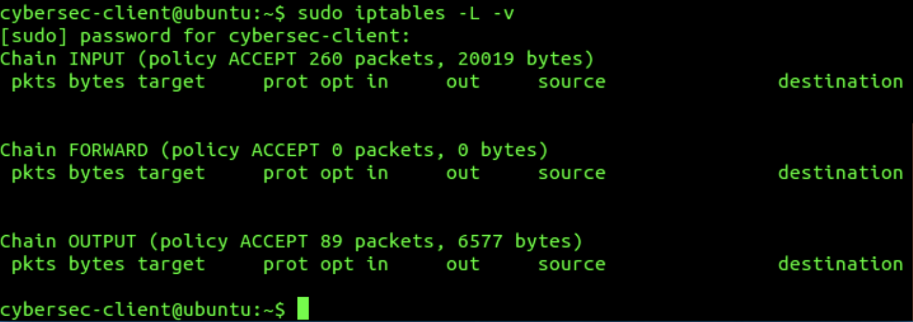
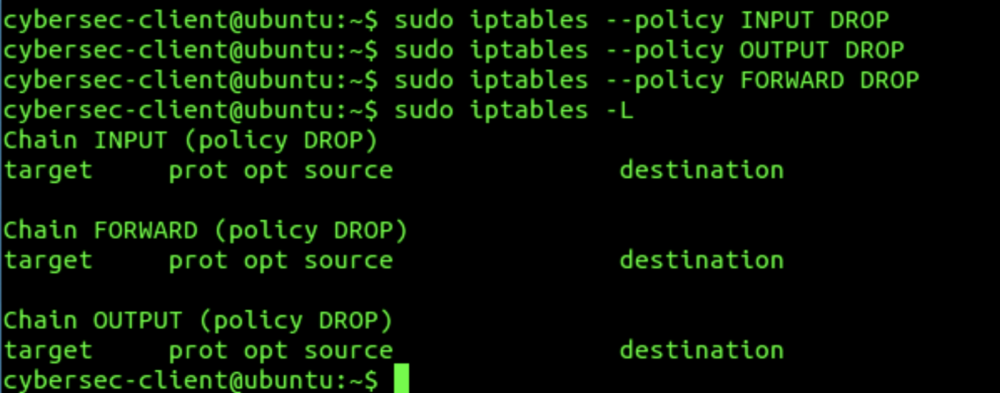
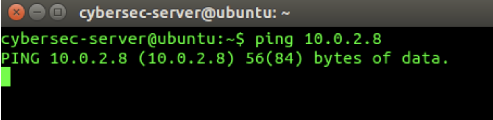
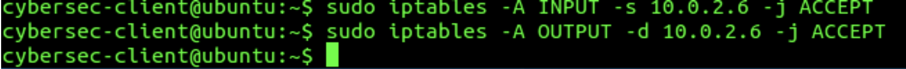
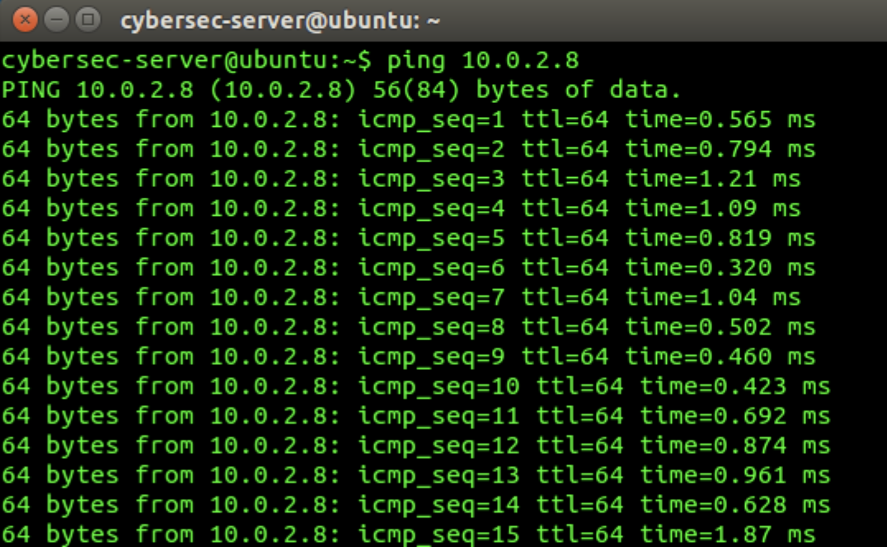
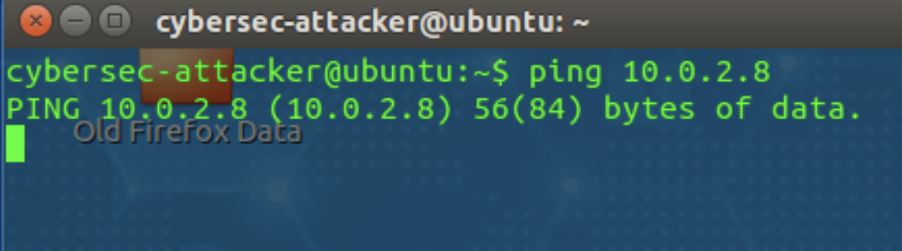
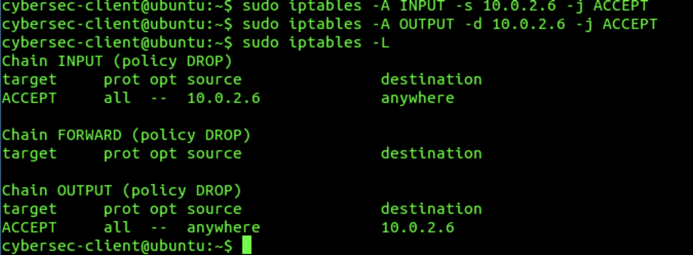
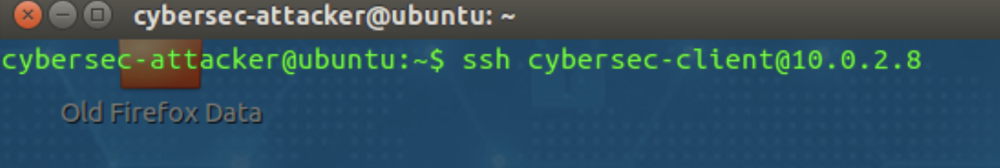
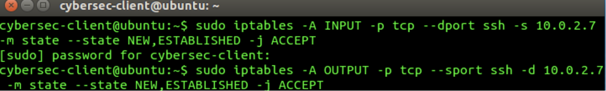
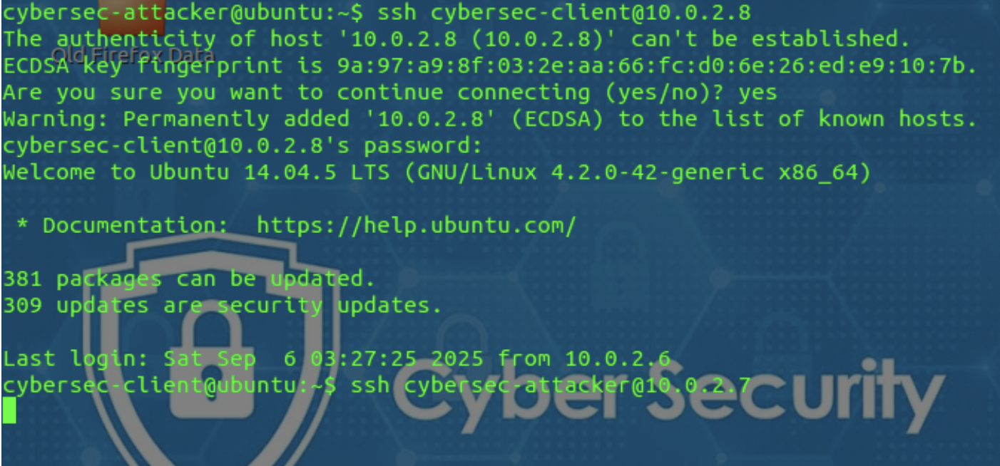

# Linux iptables and Junos Firewall Security Lab

## Overview

This project documents a controlled university cybersecurity lab focused on host-based firewall configuration, network access control and firewall user authentication.

The first part uses Linux `iptables` to apply default-deny policies, permit selected services , control ICMP and SSH traffic, inspect active rules and remove an existing rule. The second part uses Juniper Junos to configure an access profile, pass-through authentication, a login banner and a security policy requiring firewall authentication.

The purpose of the lab was to understand how firewalls enforce least-privilege access and how authentication can protect network resources from unauthorized users.

> **Ethical Scope:** All configurations and connection tests were performed in an isolated and authorized university lab environment. Credentials and infrastructure details shown in this repository have beeen redacted where appropriate.

## Lab Objectives

- Examine the initial Linux firewall ruleset.
- Configure default `DROP` policies using `iptables`.
- Permit selected HTTP and HTTPS traffic.
- Control ICMP connectivity between designated systems.
- Restrict unauthorized traffic from the attacker virtual machine.
- Permit and test an authorized SSH connection.
- Display numbered firewall rules and delete a selected rule.
- Configure a Junos firewall access profile.
- Associate the profile with pass-through authentication.
- Configure a successful-login banner.
- Apply firewall authentication through a security policy.
- Verify that the intended security controls were active.

## Tools and Environment 

- Linux virtual machines
- VMware
- Linux `iptables`
- ICMP utilities
- SSH
- Juniper Junos
- Juniper SRX firewall
- Command-line interface

---

## 1. Initial Ruleset and Default-Deny Configuration

### Examining the Initial Ruleset

The existing Linux firewall configuration was inspected before making any changes. The `iptables` ruleset contains three principal built-in chains:

- `INPUT` controls traffic entering the system.
- `OUTPUT` controls traffic leaving the system.
- `FORWARD` controls traffic routed through the system.

**Observation:** The initial ruleset used an `ACCEPT` policy and did not contain restrictive filtering rules. This meant that traffic was permitted unless a rule explicitly blocked it.

### Applying a Default-Deny Policy

The default policies for the `INPUT`, `OUTPUT` and `FORWARD` chains were changed to `DROP`. Rules were then added to permit the HTTP and HTTPS services required by the lab.

**Observation:** Changing the default policies to `DROP` caused traffic to be denied unless it matched and explicit allow rule.

**Result:** The firewall moved from a permissive configuration to a default-deny security model while retaining access for selected web services.

### Security Analysis 

A default-deny policy follows the principle of least privilege. Instead of allowing all traffic and attempting to identify every possible threat, the firewall permits only the traffic required for legitimate operation.

This approach provides several security benefits:

- Unnecessary network services are inaccessible by default.
- New services are not automatically exposed.
- Administrators must explicitly document permitted traffic.
- The attack surface of the system is reduced.
- Unauthorized inbound, outbound and forwarded traffic can be restricted.

However, default-deny policies must be implemented carefully. Required services, management access and essential system traffic should be identified before restrictive policies are applied to avoid accidently losing access to the system.

---

## 2. ICMP Access Control and Validation

### Testing the Default-Deny Policy

After the default firewall policies were changed to `DROP`, an ICMP connectivity test was performed between the designated server and client systems.

**Observation:** The ping did not receive a response because the firewall's default-deny configuration blocked traffic that did not match an explicit allow rule.

### Adding an ICMP Access Rule

A specific `iptables` rule was added to permit traffic associated with the authorized system while leaving the restrictive default policies in place.

**Observation:** The rule permitted communication for the designated address rather than allowing ICMP traffic from every system.

### Verifying Authorized Connectivity

The ping test was repeated after the new rule was applied.

**Result:** The authorized system successfully received ICMP replies, confirming that the allow rule was functioning as intended.

### Testing Unauthorized Connectivity

A separate ping test was initiated from the attacker virtual machine.

**Result:** The attacker system did not receive a response. This demonstrated that the firewall allowed the designated communication while continuing to block traffic from an unauthorized source.

### Verifying the Firewall Ruleset

The active `iptables` configuration was displayed to confirm that the ICMP-related access rule and default policies were present.

**Observation:** The displayed ruleset provided evidence that access was controlled through explicit rules rather than a broadly permissive policy.

### Security Analysis

This experiment demonstrates selective access control. A firewall rule should permit only the sources, destinations and services required for legitimate operation.

The results demonstrate several defensive principles:

- Default-deny policies block traffic that has not been explicitly authorized.
- Source-specific rules can restrict access to designated systems.
- Connectivity tests verify whether a rule produces the intended result.
- Negative testing confirms that unauthorized systems remain blocked.
- Reviewing the active ruleset helps identify configuration mistakes.

Testing both permitted and denied traffic is important. A successful authorized connection alone does not prove that a firewall is secure; administrators should also verify that unauthorized sources cannot obtain the same access.

---

## 3. SSH Access Control and Validation

### Testing SSH Before Adding Rules

An SSH connection attempt was initiated from the designated attacker virtual machine while the restrictive `iptables` policies were active.

**Observation:** The connection could not proceed because the firewall did not yet contain rules permitting the required SSH traffic.

### Adding SSH Firewall Rules

Specific `INPUT` and `OUTPUT` rules were added to permit SSH traffic between the designated systems.

**Observation:** The new rules permitted TCP traffic associated with the SSH service while leaving the default-deny policies in place.

### Verifying SSH Connectivity

The SSH connection was attempted again after the firewall rules had been applied.

**Result:** The remote login succeeded, confirming that the SSH rules permitted the intended connection.

### Security Analysis

SSH provides encrypted remote administration, but exposing the service without restrictions can create opportunities for credential attacks and unauthorized access. Firewall rules should therefore limit SSH access to the systems and users that require it.

Recommended controls include:

- Permitting SSH only from trusted source addresses.
- Using key-based authentication instead of passwords.
- Disabling direct root login.
- Applying multi-facctor authentication where available.
- Monitoring unsuccessful authentication attempts.
- Removing SSH access when it is not longer required.
- Combining firewall restrictions with secure SSH server configuration.

This experiment also demonstrates the importance of testing firewall rules after implementation. A rule may appear correct in the configuration but should be validated through an authorized connection test.

